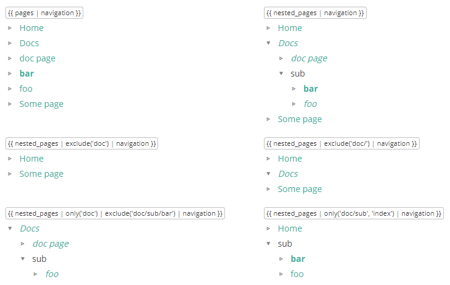

# Pico Pages List

A flat and nested pages lists plugin for [Pico CMS](http://picocms.org).

- `{{ nested_pages }}` array
- nested or flat html navigations
- pages links and directories structures
- versatile html/css for dropdown menus, single-line breadcrumbs...
- `exclude` and `only` pages filters

[](http://pico.nliautaud.fr/PicoPagesList)

## Installation

Copy `PicoPagesList.php` to the `plugins` directory of your Pico Project.

## Usage

Create a nested HTML navigation tree with :

```twig
{{ nested_pages | navigation }}
```

The nested navigation will look like that :

* [A cool page]()
* [Sub-page is coming]()
	* [The choosen one]()
	* category
		* [A page]()
* [untitled]()

The global `nested_pages` and the filter `navigation` render an HTML navigation. Works on `{{ pages }}` too.

```twig
{{ pages | navigation }} // output a flat pages list
```

## Filtering

The plugin create two additionnal Twig filters, `exclude()` and `only()`, that filters the given pages array (`pages` or `nested_pages`) by paths.

```twig
pages | exclude('path/')    // exclude the page located under "path/"
pages | only('path/')       // return only the page located at "path/"
```

Use the leading slath to target index pages or not.

```twig
pages | exclude('sub/dir/')     // exclude the page located under "sub/dir/", but not "sub/dir" (index)
pages | exclude('sub/dir')      // exclude "sub/dir" (index) and pages located under "sub/dir/"
```

You can specify multiple paths at once by using multiple arguments.

```twig
exclude('sub/dir', 'page')
only('sub/dir', 'page')
```

### Styling

The default html output is a clean nested list with extra classes that provides the possibility to build hierarchical navigations and to target specific pages and directories.

```html
<ul>
  <li class="titled is-page">
    <a href="http://mysite.com/titled">A cool page</a>
  </li>
  <li class="foo is-page has-childs is-current">
    <a href="http://mysite.com/foo">Sub-page is coming</a>
    <ul>
      <li class="child is-page has-childs is-current is-active">
        <a href="http://mysite.com/foo/child">The choosen one</a>
      </li>
      <li class="category is-directory has-childs">
        <span>category</span>
        <ul>
          <li class="bar is-page">
            <a href="http://mysite.com/foo/category/bar">A page</a>
          </li>
        </ul>
      </li>
    </ul>
  </li>
  <li class="untitled is-page">
    <a href="http://mysite.com/untitled">untitled</a>
  </li>
</ul>
```

```css
.foo-item { /* an item named "foo-item" */ }
.foo-item > a { /* the link of a page named "foo-item" */ }
.foo-item > span { /* the name of a directory named "foo-item"  */ }
.foo-item > ul { /* the childs of "foo-item" */ }
.foo-item > ul ul { /* the deep childs of "foo-item" */ }

.is-page { /* the pages, with links */ }
.is-directory { /* the directories, with simple names */ }
.is-current { /* the current page */ }
.is-active { /* the items in the path of the current page */ }
.has-childs { /* the items with childs */ }
```

As a simple example, you may show sub-pages only if their parent is active :

```css
.mymenu li.is-page:not(.is-active) ul {
    display: none;
}
```

## Custom loop

The `{{ nested_pages }}` global is an array of pages, similar to `{{ pages }}`, where sub-pages are nested into `_childs`.

You may want a recursive Twig template or macro to walk trough it, for example :

```twig

  <ul>
  
    <li>
      
        <a href="{{ item.url }}">{{ item.title }}</a> : {{ item.description }}
      
        <span>{{ name }}</span>
      
      
        
        {{ macros.menu(item._childs) }}
      
    </li>
  
  </ul>



{{ macros.menu(nested_pages) }}
```

## Settings

The lists are sorted according to the default settings in Pico `config.php`.

```yml
pages_order_by: date
pages_order: desc
```
